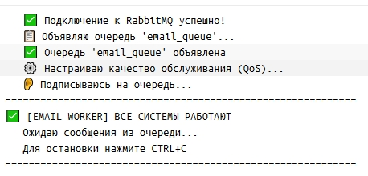
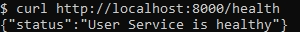
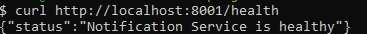
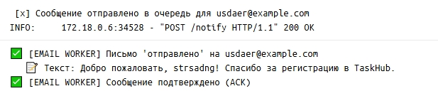
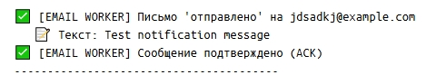
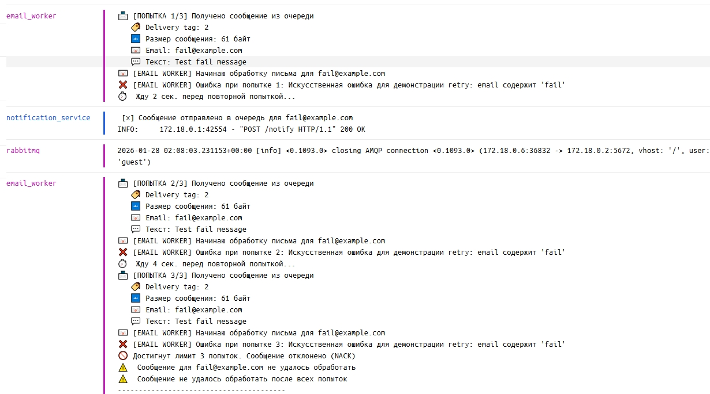
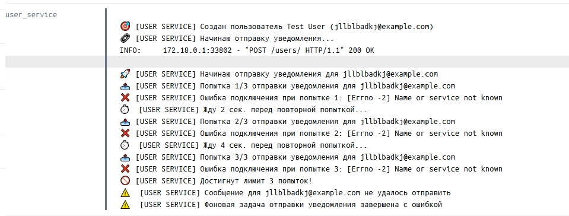

# Финальный отчет по проекту TaskHub

## 1. Выполненные задачи
- [x] Разработка трех микросервисов
- [x] Интеграция через RabbitMQ
- [x] Настройка Docker Compose
- [x] Документация API
- [x] Тестирование системы

## 2. Особенности реализации
- Асинхронная обработка уведомлений
- Изолированные базы данных
- Health checks для всех сервисов
- Подробное логирование
- **Механизм Retry:**
   - Реализован вручную (без сторонних библиотек) для большей прозрачности
   - Экспоненциальная задержка предотвращает перегрузку системы
   - Разные стратегии для разных типов ошибок
   - Детальное логирование каждой попытки

## 3. Инструкция по запуску

Предварительные требования:
- **Docker Desktop** (с WSL2 на Windows)
- **Git**
- **Python 3.11+** (для локальных тестов)

### Установка и запуск

```bash
# 1. Клонируйте репозиторий
git clone <ваш-репозиторий>
cd taskhub-notification-system

# 2. Запустите все сервисы
docker-compose up --build

# 3. Откройте новый терминал для тестирования

# 4. Проверьте работоспособность
curl http://localhost:8000/health
curl http://localhost:8001/health

# 5. Создайте тестового пользователя
curl -X POST "http://localhost:8000/users/" \
  -H "Content-Type: application/json" \
  -d '{"email": "test@example.com", "name": "Test User"}'

# 6. Проверьте создание
curl http://localhost:8000/users/
```

## 4. Примеры работы
1) Оповещение при запуске системы: 

2) Проверка работоспособности User Service: 

3) Проверка работоспособности Notification Service: 

4) Проверка системы регистрации пользователя: 

5) Проверка отправки сообщения: 

6) Механизм повторных попыток (retry) для Email Worker: 

7) Механизм повторных попыток (retry) для User Service: 

## 5. Заключение
Система успешно реализована и готова к использованию.
