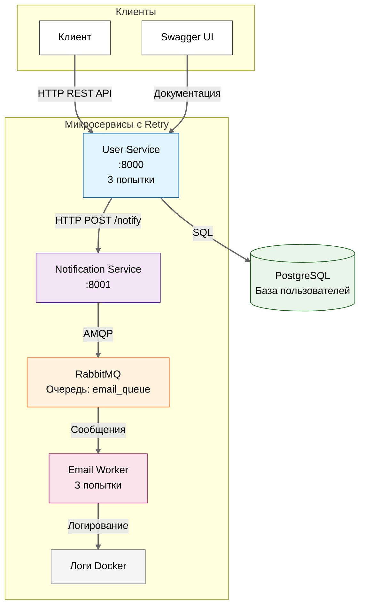

# TaskHub - Микросервисная система уведомлений

## О проекте
Учебный проект по разработке микросервисной системы на базе Docker, FastAPI, RabbitMQ и PostgreSQL.

## Архитектура системы



### Схема взаимодействия:
┌─────────────┐ HTTP ┌──────────────┐ SQL ┌─────────────┐

│ Клиент ├─────────────►│ User Service ├────────────►│ PostgreSQL │

│ (Postman, │ │ :8000 │ │ :5432 │

│ curl) │◄─────────────┤ │◄────────────┤ │

└─────────────┘ └──────┬───────┘ └─────────────┘

│

│ HTTP

▼

┌────────────────────┐ AMQP ┌─────────────┐

│ Notification ├─────────────►│ RabbitMQ │

│ Service │ │ :5672 │

│ :8001 │◄─────────────┤ (очередь) │

└────────────────────┘ └──────┬──────┘

│

│ AMQP

▼

┌────────────────────┐

│ Email Worker │

│ (фоновый процесс) │

└────────────────────┘

│

▼

┌────────────────────┐

│ Логирование │

│ (консоль) │

└────────────────────┘


## Технологический стек

| Компонент               | Технология               | Назначение                     |
|-------------------------|--------------------------|--------------------------------|
| **User Service**        | Python, FastAPI, Pydantic| REST API для управления пользователями |
| **Notification Service**| Python, FastAPI, Pika    | Отправка сообщений в RabbitMQ  |
| **Email Worker**        | Python, Pika             | Обработка сообщений из очереди |
| **База данных**         | PostgreSQL               | Хранение данных пользователей  |
| **Message Broker**      | RabbitMQ                 | Асинхронная очередь сообщений  |
| **Контейнеризация**     | Docker, Docker Compose   | Изоляция и управление сервисами|

## Структура проекта
taskhub-notification-system/
├── user_service/ # Сервис пользователей (порт 8000)

│ ├── app/
│ │ ├── main.py # Основное приложение FastAPI

│ │ ├── database.py # Подключение к PostgreSQL

│ │ └── models.py # Модели SQLAlchemy

│ ├── requirements.txt # Зависимости Python

│ └── Dockerfile # Конфигурация Docker

│

├── notification_service/ # Сервис уведомлений (порт 8001)

│ ├── app/

│ │ └── main.py # FastAPI + RabbitMQ клиент

│ ├── requirements.txt

│ └── Dockerfile

│

├── email_worker/ # Фоновый обработчик писем

│ ├── app/

│ │ └── main.py # Consumer RabbitMQ

│ ├── requirements.txt

│ └── Dockerfile

│

├── docker-compose.yml # Конфигурация всех сервисов

├── docker-compose.yml # Конфигурация Docker Compose

├── README.md # Эта документация

├── TaskHub_Postman_Collection.json # Коллекция Postman

└── test_full_chain.py # Тестовый скрипт Python

# Примеры использования

**Создание пользователя**
```bash
curl -X POST http://localhost:8000/users/ \
  -H "Content-Type: application/json" \
  -d '{"email": "test@example.com", "name": "Test User"}'
```
**Отправка письма**
```
curl -X POST http://localhost:8001/notify \
   -H "Content-Type: application/json" \
   -d '{"email": "test@example.com", "message": "Test message"}'
```

## Механизм повторных попыток (Retry)

Реализовано в двух местах:

Система реализует надежный механизм повторных попыток при сбоях:

**В двух местах системы:**

#### **User Service → Notification Service:**
- **Лимит попыток:** 3
- **Стратегия задержки:** Экспоненциальная (2, 4, 8 секунд)
- **Триггер:** Ошибки HTTP или недоступность сервиса
- **Реализация:** Цикл с обработкой исключений

#### **Email Worker → Обработка сообщений:**
- **Лимит попыток:** 3
- **Стратегия задержки:** Экспоненциальная (2, 4, 8 секунд)
- **Триггер:** Любые ошибки при обработке сообщений
- **Особенность:** Искусственная ошибка при email с "fail" (для демонстрации)

### Демонстрация механизма Retry

#### Тест 1: Retry при недоступности Notification Service
```bash
# Остановите notification_service
docker-compose stop notification_service

# Создайте пользователя (увидите 3 попытки в логах)
curl -X POST http://localhost:8000/users/ \
  -H "Content-Type: application/json" \
  -d '{"email": "retry_test@example.com", "name": "Test Retry"}'

# Наблюдайте логи retry
docker-compose logs -f user_service
```

#### Тест 2: Retry в Email Worker
```bash
# Отправьте тестовое сообщение с "fail" в email
curl -X POST http://localhost:8001/notify \
  -H "Content-Type: application/json" \
  -d '{"email": "fail_test@example.com", "message": "Тест retry механизма"}'

# Наблюдайте 3 попытки обработки
docker-compose logs -f email_worker
```
# Ожидаемые логи retry:
```text
📤 [USER SERVICE] Попытка 1/3 отправки уведомления...
❌ [USER SERVICE] Ошибка подключения при попытке 1
⏱️  [USER SERVICE] Жду 2 сек. перед повторной попыткой...
📤 [USER SERVICE] Попытка 2/3 отправки уведомления...
❌ [USER SERVICE] Ошибка подключения при попытке 2
⏱️  [USER SERVICE] Жду 4 сек. перед повторной попыткой...
📤 [USER SERVICE] Попытка 3/3 отправки уведомления...
❌ [USER SERVICE] Ошибка подключения при попытке 3
🚫 [USER SERVICE] Достигнут лимит 3 попыток
```

## Быстрый старт

### Предварительные требования
- **Docker Desktop** (с WSL2 на Windows)
- **Git**
- **Python 3.11+** (для локальных тестов)

### Установка и запуск

```bash
# 1. Клонируйте репозиторий
git clone https://github.com/svetofor56/taskhub-notification-system
cd taskhub-notification-system

# 2. Запустите все сервисы
docker-compose up --build

# 3. Откройте новый терминал для тестирования

# 4. Проверьте работоспособность
curl http://localhost:8000/health
curl http://localhost:8001/health

# 5. Создайте тестового пользователя
curl -X POST "http://localhost:8000/users/" \
  -H "Content-Type: application/json" \
  -d '{"email": "test@example.com", "name": "Test User"}'

# 6. Проверьте создание
curl http://localhost:8000/users/
```

### Доступ к сервисам
После запуска система доступна по следующим адресам:

Сервис	URL	Назначение
User Service API	http://localhost:8000	Основной REST API

Swagger UI	http://localhost:8000/docs	Интерактивная документация API

Notification Service	http://localhost:8001	API уведомлений

RabbitMQ Management	http://localhost:15672	Веб-интерфейс RabbitMQ

Health Check	http://localhost:8000/health	Проверка работоспособности

Данные для входа в RabbitMQ:

Логин: guest

Пароль: guest

# Основные API endpoints

User Service (порт 8000)
```
http
POST /users/
Content-Type: application/json

{
    "email": "user@example.com",
    "name": "Имя Фамилия"
}
http
```

```
GET /users/
Возвращает список всех пользователей.
```

```
http
GET /health
Проверка работоспособности сервиса.
```

Notification Service (порт 8001)
```
http
POST /notify
Content-Type: application/json

{
    "email": "user@example.com",
    "message": "Текст уведомления"
}
```

# Тестирование
1. Полный тест через Python скрипт
```
powershell
py test_full_chain.py
```

2. Индивидуальные тесты через curl
```bash
# Проверка здоровья
curl http://localhost:8000/health
curl http://localhost:8001/health


# Создание пользователя

curl -X POST "http://localhost:8000/users/" \
  -H "Content-Type: application/json" \
  -d '{"email": "test@test.com", "name": "Test"}'


# Получение списка пользователей
curl http://localhost:8000/users/

# Прямая отправка уведомления
curl -X POST "http://localhost:8001/notify" \
  -H "Content-Type: application/json" \
  -d '{"email": "test@test.com", "message": "Test"}'
```

3. Мониторинг логов
```bash
# Просмотр логов всех сервисов
docker-compose logs -f

# Логи конкретного сервиса
docker-compose logs -f user_service
docker-compose logs -f email_worker
```

4. Тестирование механизма Retry
```bash
# 1. Остановите notification_service
docker-compose stop notification_service

# 2. Запустите тест retry
python -c "
import requests
print('Testing retry mechanism...')
try:
    response = requests.post('http://localhost:8000/users/',
        json={'email': 'retry_test@example.com', 'name': 'Retry Test'})
    print(f'Response: {response.status_code}')
except Exception as e:
    print(f'Error: {e}')
"

# 3. Проверьте, что пользователь создан (несмотря на ошибку уведомления)
curl http://localhost:8000/users/

# 4. Проверьте логи retry
docker-compose logs user_service --tail=15


# 5. Тестирование Email Worker с искусственной ошибкой
```bash
# Сообщение с "fail" в email вызовет искусственную ошибку для демонстрации retry
curl -X POST http://localhost:8001/notify \
  -H "Content-Type: application/json" \
  -d '{"email": "fail_retry_test@example.com", "message": "Testing retry"}'
```

5. Проверка здоровья системы
```bash
# Все сервисы должны отвечать
curl http://localhost:8000/health
curl http://localhost:8001/health
```

6. Интеграционные тесты
```bash
# Тест создания пользователя и проверки, что он сохранен
curl -X POST http://localhost:8000/users/ \
  -H "Content-Type: application/json" \
  -d '{"email": "integration_test@example.com", "name": "Integration Test"}'
  
sleep 2
curl http://localhost:8000/users/ | grep -i "integration_test"
```

# Поиск и устранение неисправностей
Проблема	Решение
Ошибка портов	Убедитесь, что порты 8000, 8001, 15672 свободны
RabbitMQ не подключается	Проверьте docker-compose logs rabbitmq
PostgreSQL недоступен	Подождите 10-15 секунд после запуска
Нет логов email_worker	Проверьте буферизацию: в Dockerfile добавьте -u к python
422 ошибка в Postman	Проверьте заголовок Content-Type: application/json

# Мониторинг
RabbitMQ Management
Откройте http://localhost:15672 для мониторинга очередей:

Перейдите на вкладку Queues

Найдите очередь email_queue

Проверьте:

Consumers (должен быть 1)

Messages (количество сообщений в очереди)

### Мониторинг механизма Retry

1. **Логи User Service при retry:**
   ```bash
   docker-compose logs user_service --tail=20
   ```
   Ищите сообщения: "Попытка X/3", "Жду X сек.", "Достигнут лимит"

2. **Логи Email Worker при retry:**
   ```bash
   docker-compose logs email_worker --tail=30
   ```
   Ищите сообщения: "[ПОПЫТКА X/3]", "Жду X сек.", "Достигнут лимит"

3. **RabbitMQ для наблюдения за повторно отправляемыми сообщениями:**
   - Откройте: http://localhost:15672
   - Очередь `email_queue` показывает:
     - **Ready:** Сообщения, ожидающие обработки
     - **Unacked:** Сообщения, взятые worker'ом

### Особенности и принятые решения

1. **Механизм Retry:**
   - Реализован вручную (без сторонних библиотек) для большей прозрачности
   - Экспоненциальная задержка предотвращает перегрузку системы
   - Разные стратегии для разных типов ошибок
   - Детальное логирование каждой попытки

2. **Обработка ошибок:**
   - User Service: продолжает работу даже при недоступности Notification Service
   - Email Worker: не зацикливается на неисправимых ошибках (невалидный JSON)
   - Все ошибки логируются с контекстом для отладки

3. **Асинхронность:**
   - Уведомления отправляются асинхронно, не блокируя ответ клиенту
   - Использование `asyncio.create_task` для фоновых задач
   - Обработка результатов фоновых задач с callback'ами

4. **Надёжность:**
   - Очереди RabbitMQ сохраняются при перезагрузке (durable=True)
   - Health checks в docker-compose.yml
   - Автоматические повторные подключения к RabbitMQ
   
# Docker контейнеры
```bash
# Статус всех контейнеров
docker-compose ps

# Статистика использования ресурсов
docker stats

# Просмотр логов в реальном времени
docker-compose logs -f

```
# Остановка системы
```bash
# Остановить с сохранением данных
docker-compose down

# Остановить и удалить все данные
docker-compose down -v

# Остановить конкретный сервис
docker-compose stop user_service

# Перезапустить сервис
docker-compose restart email_worker
```

# Документация и ссылки
API документация
User Service Swagger UI: http://localhost:8000/docs

Notification Service Swagger UI: http://localhost:8001/docs


# Полезные ссылки
Docker документация: https://docs.docker.com/

FastAPI документация: https://fastapi.tiangolo.com/

RabbitMQ документация: https://www.rabbitmq.com/documentation.html

PostgreSQL документация: https://www.postgresql.org/docs/


# Файлы проекта
Postman коллекция - импортируйте в Postman

docker-compose.yml - конфигурация Docker Compose

# Разработка
Локальная разработка
```bash
# Запустить все зависимости (без сервисов)
docker-compose up -d rabbitmq db_user_service

# Запустить сервис в режиме разработки
cd user_service
py -m venv venv
source venv/Scripts/activate  # или .\venv\Scripts\activate.ps1 в PowerShell
pip install -r requirements.txt
uvicorn app.main:app --reload --port 8000
```
# Добавление нового сервиса
Создайте папку с сервисом

Добавьте Dockerfile и requirements.txt

Обновите docker-compose.yml

Протестируйте: 
```docker-compose up --build <service_name>```

# Лицензия:
Учебный проект, выполненный в рамках практического задания по микросервисной архитектуре.

# Автор:
Передеренко Никита Вячеславович; 
Магистратура; 
Прикладная информатика 2 курс. 

**Группа:**
НВРС24-М-ЦР02


# Компоненты системы

**1. User Service (порт 8000)**

REST API на FastAPI

Работа с PostgreSQL

Валидация данных через Pydantic

**2. Notification Service (порт 8001)**

Прием HTTP запросов

Отправка сообщений в RabbitMQ

Асинхронная обработка

**3. Email Worker**

Фоновый процесс

Чтение сообщений из очереди

Имитация отправки email

**4. RabbitMQ**

Message Broker

Очередь email_queue

Веб-интерфейс на порту 15672

**5. PostgreSQL**

Реляционная база данных

Хранение информации о пользователях

Изолированная БД для каждого сервиса

