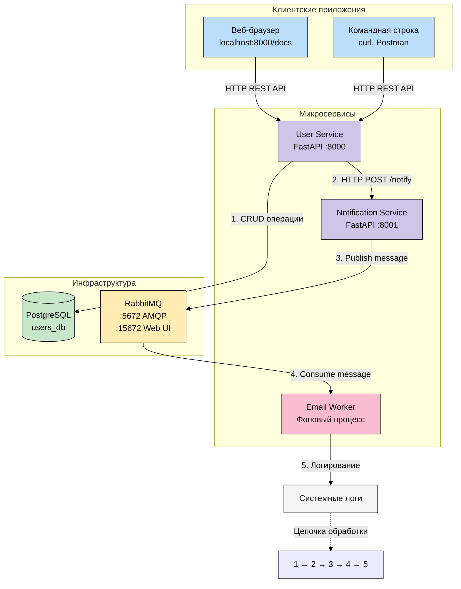

```mermaid
flowchart TB
    subgraph "Клиентские приложения"
        Web[Веб-браузер<br/>localhost:8000/docs]
        CLI[Командная строка<br/>curl, Postman]
    end
    
    subgraph "Микросервисы"
        US[User Service<br/>FastAPI :8000]
        NS[Notification Service<br/>FastAPI :8001]
        EW[Email Worker<br/>Фоновый процесс]
    end
    
    subgraph "Инфраструктура"
        PSQL[(PostgreSQL<br/>users_db)]
        RMQ[RabbitMQ<br/>:5672 AMQP<br/>:15672 Web UI]
    end
    
    %% Взаимодействия
    Web -->|HTTP REST API| US
    CLI -->|HTTP REST API| US
    
    US -->|1. CRUD операции| PSQL
    US -->|2. HTTP POST /notify| NS
    
    NS -->|3. Publish message| RMQ
    
    RMQ -->|4. Consume message| EW
    EW -->|5. Логирование| LOG[Системные логи]
    
    %% Легенда
    LOG -.->|Цепочка обработки| Legend[1 → 2 → 3 → 4 → 5]
    
    %% Стили с чёрным текстом
    style Web fill:#bbdefb,stroke:#000,color:#000
    style CLI fill:#bbdefb,stroke:#000,color:#000
    style US fill:#d1c4e9,stroke:#000,color:#000
    style NS fill:#d1c4e9,stroke:#000,color:#000
    style EW fill:#f8bbd0,stroke:#000,color:#000
    style PSQL fill:#c8e6c9,stroke:#000,color:#000
    style RMQ fill:#ffecb3,stroke:#000,color:#000
    style LOG fill:#f5f5f5,stroke:#000,color:#000
    style Legend stroke:#000,color:#000
    
    %% Цвета стрелок и текста на стрелках
    linkStyle default stroke:#000,color:#000
```
