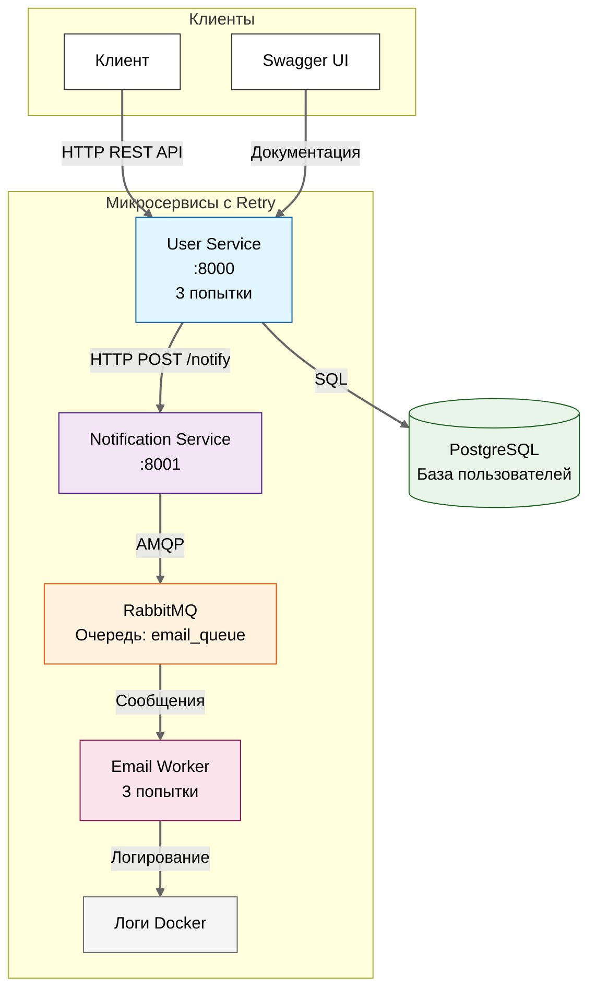

```mermaid
graph TB
    subgraph "Микросервисы с Retry"
        US[User Service<br/>:8000<br/>3 попытки] -->|HTTP POST /notify| NS[Notification Service<br/>:8001]
        NS -->|AMQP| RMQ[RabbitMQ<br/>Очередь: email_queue]
        RMQ -->|Сообщения| EW[Email Worker<br/>3 попытки]
        EW -->|Логирование| LOG[Логи Docker]
    end
    
    subgraph "Клиенты"
        C1[Клиент] -->|HTTP REST API| US
        C2[Swagger UI] -->|Документация| US
    end
    
    US -->|SQL| DB[(PostgreSQL<br/>База пользователей)]
    
    style US fill:#e1f5fe,stroke:#01579b,color:#000000
    style NS fill:#f3e5f5,stroke:#4a148c,color:#000000
    style EW fill:#fce4ec,stroke:#880e4f,color:#000000
    style RMQ fill:#fff3e0,stroke:#e65100,color:#000000
    style DB fill:#e8f5e8,stroke:#1b5e20,color:#000000
    style C1 fill:#ffffff,stroke:#333333,color:#000000
    style C2 fill:#ffffff,stroke:#333333,color:#000000
    style LOG fill:#f5f5f5,stroke:#666666,color:#000000
    
    linkStyle default stroke:#666666,stroke-width:2px,color:#000000
```
